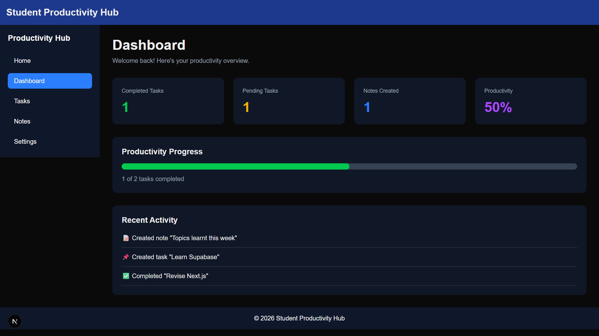
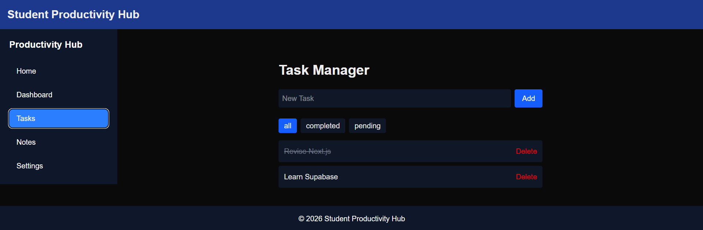
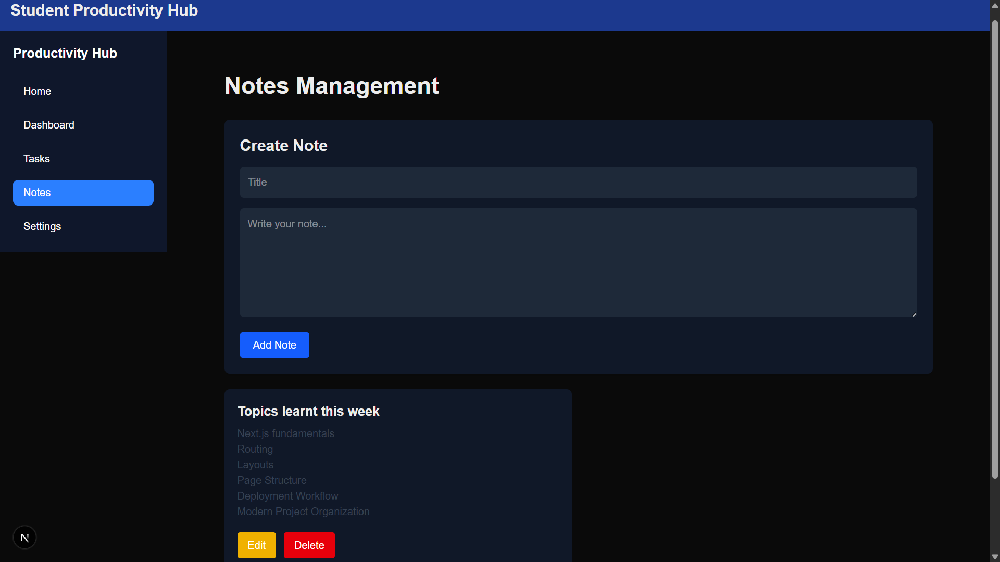

# 📚 Student Productivity Hub v2

A modern productivity web application built with **Next.js**, **TypeScript**, and **Tailwind CSS**. It helps students organize tasks and notes through a clean, responsive dashboard.

## ✨ Features

* 📊 Dashboard with productivity statistics
* ✅ Task management (add, complete, delete, and filter tasks)
* 📝 Notes management (create, edit, and delete notes)
* ⚙️ Settings page
* 📱 Responsive design
* 💾 Local Storage for data persistence

## 📸 Screenshots

* 
* 
* 

## 🛠 Tech Stack

* Next.js (App Router)
* React
* TypeScript
* Tailwind CSS
* Local Storage
* Vercel

## 🚀 Getting Started

Clone the repository:

```bash
git clone https://github.com/yourusername/student-productivity-hub-v2.git
```

Go to the project folder:

```bash
cd student-productivity-hub-v2
```

Install dependencies:

```bash
npm install
```

Start the development server:

```bash
npm run dev
```

Open your browser and visit:

```
http://localhost:3000
```

## 🔮 Future Improvements

* User authentication
* Database integration
* Dark mode
* Markdown support for notes
* Task priorities and due dates
* Search and filtering