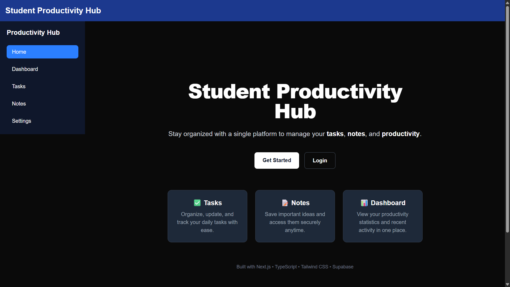
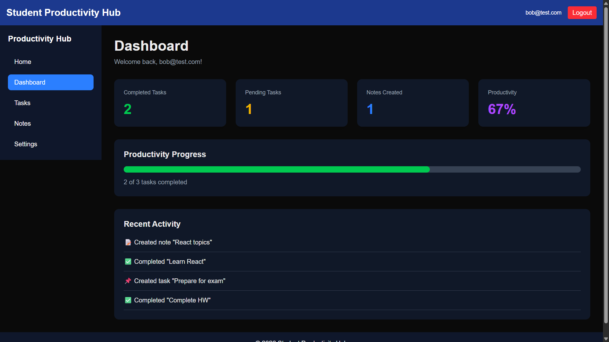
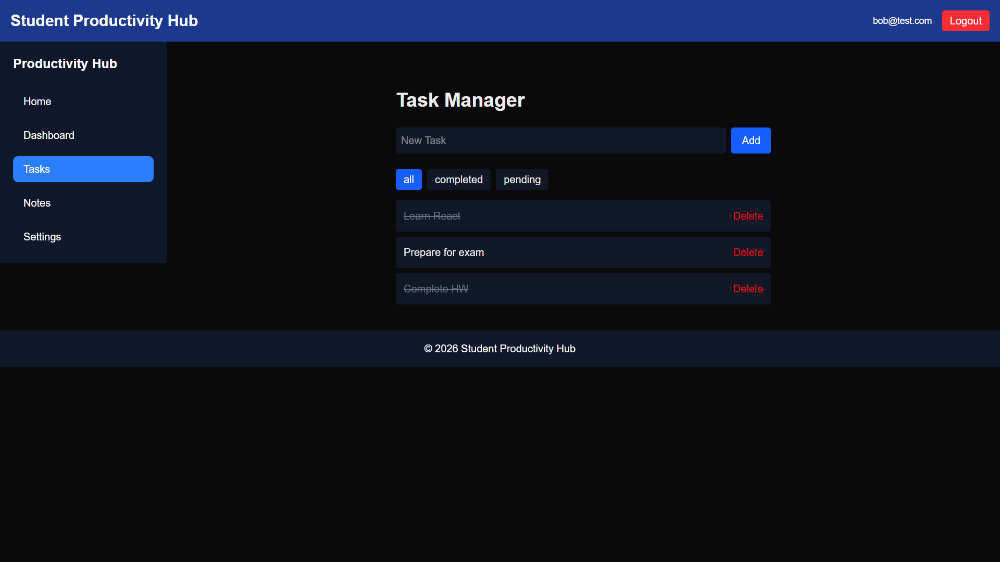
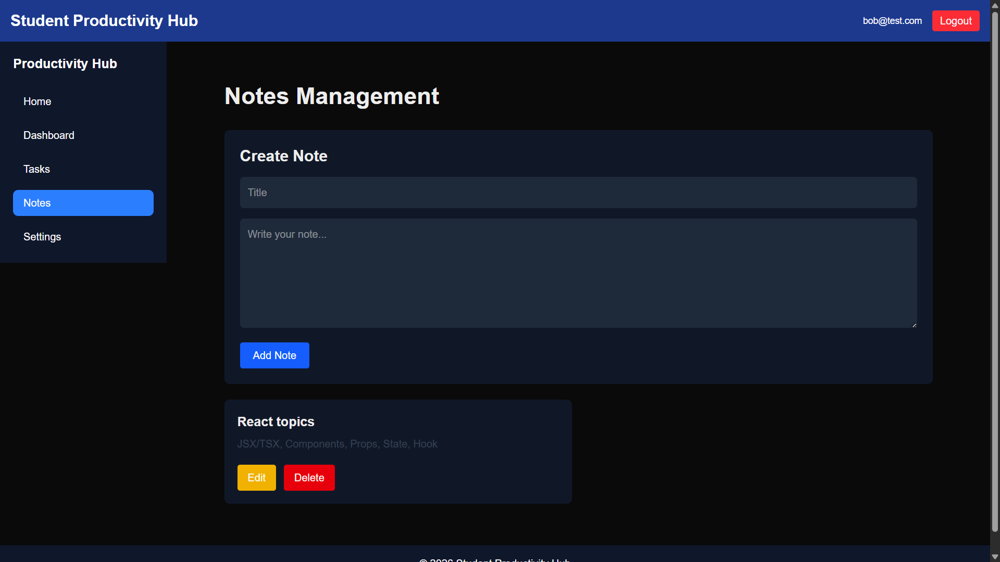
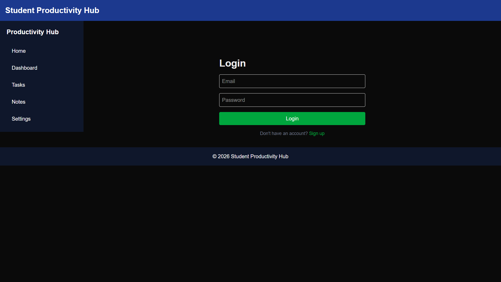
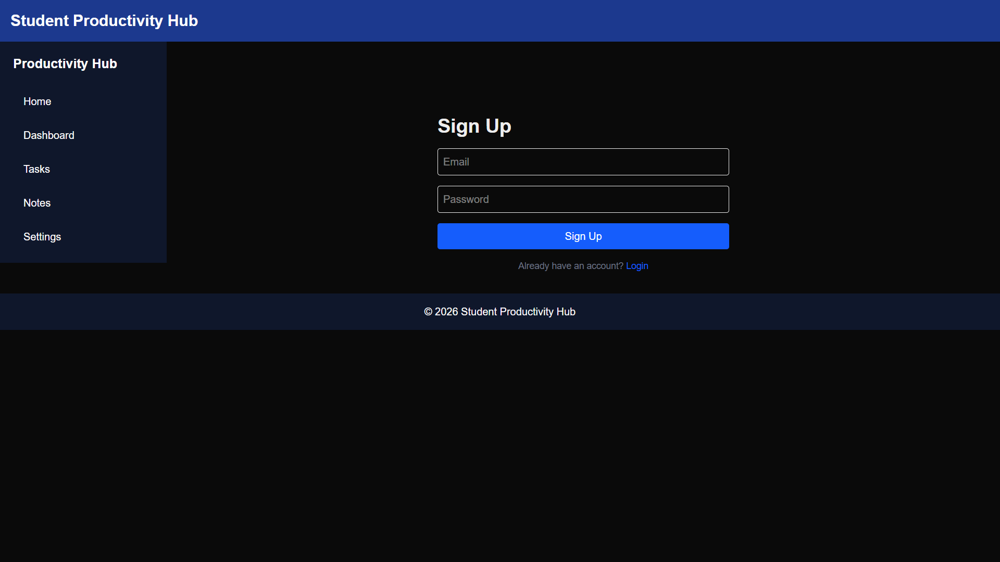

# 📚 Student Productivity Hub v3

A full-stack productivity web application built with **Next.js**, **TypeScript**, **Tailwind CSS**, and **Supabase**. It helps students securely manage tasks and notes with cloud storage and authentication.

## ✨ Features

* 🔐 User Authentication (Sign Up, Login, Logout)
* 📊 Personalized Dashboard
* ✅ Cloud-based Task Management (CRUD)
* 📝 Cloud-based Notes Management (CRUD)
* 🔒 Protected Routes & Row-Level Security (RLS)
* 📱 Responsive Design

## 📸 Screenshots

* 
* 
* 
* 
* 
* 

## 🛠 Tech Stack

* Next.js (App Router)
* React
* TypeScript
* Tailwind CSS
* Supabase
* PostgreSQL
* Vercel

## 🚀 Getting Started

```bash
git clone https://github.com/snehithpanda007-lgtm/student-productivity-hub-v3.git
cd student-productivity-hub-v3
npm install
```

Create a `.env.local` file:

```env
NEXT_PUBLIC_SUPABASE_URL=your_project_url
NEXT_PUBLIC_SUPABASE_ANON_KEY=your_anon_key
```

Run the app:

```bash
npm run dev
```

Visit: `http://localhost:3000`

## 🔒 Security

* Supabase Authentication
* Row-Level Security (RLS)
* Protected Routes

## 🚀 Live Demo

https://student-productivity-hub-v3.vercel.app

## 💻 GitHub

https://github.com/snehithpanda007-lgtm/student-productivity-hub-v3